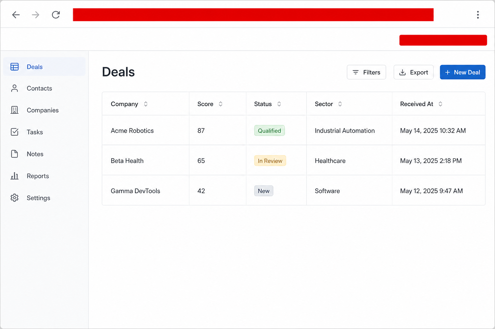
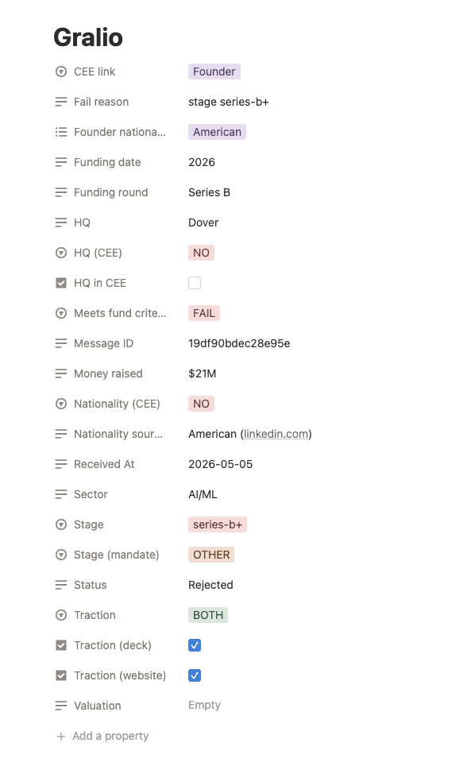
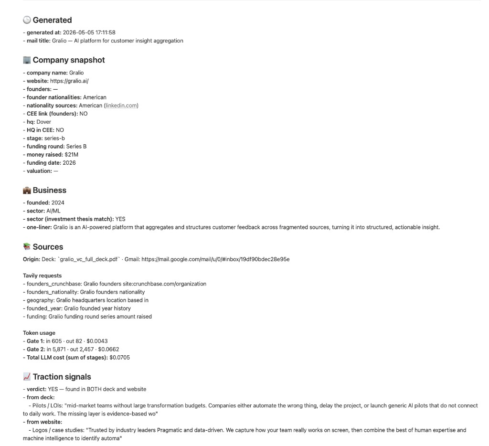

# Fund Screening Agent

AI-powered deal screening pipeline for early-stage VC funds.

Reads inbound pitch emails (Gmail + PDF deck), runs multi-gate screening against the fund's investment thesis, scores deals, and syncs structured output to a Notion CRM — no investment decisions, just clean decision support.

Built for a CEE-focused seed fund mandate (configurable in `config/fund_thesis.py`).

**What this file is:** a short landing page—demo, gates summary, quick start. **End-to-end order (intake → gates → SQLite → optional Notion):** [docs/PIPELINE_FLOW.md](docs/PIPELINE_FLOW.md). **Full doc index by category / role:** [docs/README.md](docs/README.md).

## Demo (this is not plug-and-play)

The pipeline is a **local CLI**: it expects your own **API keys** and (for full flow) **Gmail OAuth** + **Notion** tokens in `.env`. There is no hosted “Try it” button — reviewers should treat the files below as **evidence of shape and output**, not a live product.

| Artifact | What it shows |
|----------|----------------|
| [examples/sample_run_log.txt](examples/sample_run_log.txt) | Anonymized console trace: stages through **`Notion: scanned=…`** (typical `--once` + sync). |
| [examples/notion_pipeline_screenshot.png](examples/notion_pipeline_screenshot.png) | **Real** Notion database table (pipeline / deals list after sync). |
| [examples/notion_deal_page_sample.png](examples/notion_deal_page_sample.png) | Sample **deal record** in Notion (row-level properties). |
| [examples/notion_deal_memo_sample.png](examples/notion_deal_memo_sample.png) | Sample **on-page memo** (snapshot, sources, LLM cost, traction). |
| [examples/sample_screening_output.md](examples/sample_screening_output.md) | Anonymized text summary of a screening result. |

**Public pipeline view (read-only Notion Site):**  
https://triangular-marlin-23b.notion.site/34db6499819080cf9a57f33de6e2662d?v=34db64998190808c9937000c1a7ff01a

(This replaces a private workspace view — safe for reviewers; no API keys required to **view**.)

The repo **Website** on GitHub is set to the same URL for one-click access.

## How it works

| Gate | What it does |
|------|-------------|
| **Gate 0** | Deterministic pre-filter: skips legal/NDA emails, only calls LLM when pitch signals are present |
| **Gate 1** | Mandate fit check from email body + PDF metadata (no full deck parse yet) |
| **Gate 2** | Full deck → markdown/OCR → fact extraction, scorecard, fund fit decision |
| **Gate 2.5** | Optional: external enrichment (web crawl, deeper context) |
| **HITL** | Optional: interactive review or skip |

**Website mode:** `python main.py assess-url https://…` — crawl → facts → scoring → same pipeline record.

## Key integrations

- **Gmail** — OAuth polling for inbound pitches
- **PDF/OCR** — Tesseract-based deck extraction
- **Notion** — auto-sync deals to a CRM table (status, thesis fit, rationale, memo)
- **Fireflies** — webhook or CLI pull for founder call notes, attached to the deal record

## Repo structure

```
agents/       — screening logic (Gate 1/2/2.5, website, scoring, Notion sync)
tools/        — Gmail, PDF/OCR, web crawl
storage/      — SQLite pipeline.db
config/       — prompts, scoring weights, LLM cost tracking
tests/        — unit tests
docs/         — index: docs/README.md; chronology: docs/PIPELINE_FLOW.md; PRD, specs, rubrics
```

## Quick start

```bash
python3 -m venv venv && source venv/bin/activate
pip install -r requirements.txt
cp .env.example .env    # fill in API keys
python main.py --setup  # Gmail OAuth
python main.py --once   # single polling run
```

Requires Python 3.9+, Tesseract (for PDF OCR), Gmail OAuth credentials.

## Example output (Notion)

**Live read-only table (sanitized duplicate):** [Open in Notion](https://triangular-marlin-23b.notion.site/34db6499819080cf9a57f33de6e2662d?v=34db64998190808c9937000c1a7ff01a)

Sync maps each SQLite deal to a **Notion database row** plus a **child page memo** (structured sections: snapshot, sources, costs/telemetry, deck/website markdown, founder calls, etc.). The exact **property set and table layout** depend on sync mode and schema helpers in `agents/notion_sync.py`; the intended operating semantics and acceptance-style notes are in **`docs/PRD.md`** (Notion section) and contributor layout rules in **`docs/CURSOR_NOTION_INSTRUCTIONS.md`**. Treat the public site as **illustrative** of shape, not a guarantee of every column name in your own workspace.

**Screenshots from Notion (actual UI — not the old AI CRM placeholder):**

1. Pipeline **table** view:



2. **Deal record** (properties):



3. **Deal memo** body (structured sections):



*(The first repo image used to be a generated “Deals / Acme Robotics” CRM mock — that was **not** Notion; it is replaced by the shots above.)*

## Documentation

| Start here | Purpose |
|------------|---------|
| [docs/PIPELINE_FLOW.md](docs/PIPELINE_FLOW.md) | **Chronological** pipeline—fetch order, each gate, DB write, optional Notion / Fireflies |
| [docs/README.md](docs/README.md) | **Category index**—product vs runtime vs integrations; reading paths by role |
| [docs/PRD.md](docs/PRD.md) | Full product contract |
| [ARCHITECTURE.md](ARCHITECTURE.md) | Diagram, stack, env vars, LLM vs Tavily/SerpAPI |
| [docs/KNOWN_LIMITATIONS.md](docs/KNOWN_LIMITATIONS.md) | Prototype boundaries |

Context (repo root): [APPLICATION_NOTE.md](APPLICATION_NOTE.md), [APPLICATION_USE_CASES.md](APPLICATION_USE_CASES.md).

All other spec files (LLM map, rubric, Notion contract, stubs) are listed under [docs/README.md](docs/README.md).
